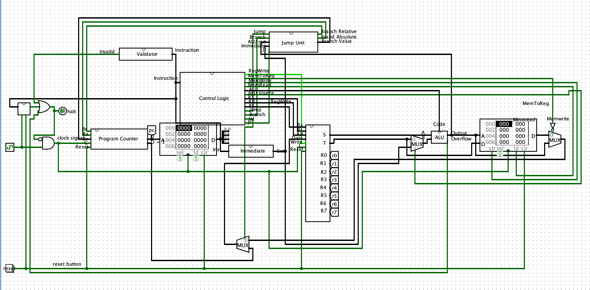

<h1 align="center">datapath</h1>

<p style="text-align: center;"><em>A project by Flor Ronsmans De Vry and Achraf Yandouzi for the Computer Systems and Architecture course at the University of Antwerp.</em></p>

<div align="center"></img></div>

___

## Project goals
The aim of this project was to design a simple datapath which could run MIPS-like assembly. The datapath and its logical components were built from the ground up.

## Design software
The datapath was developed within Logisim, which can be downloaded [here](http://www.cburch.com/logisim/). The Logisim executable powering our tests can be found at `common/logisim-generic-2.7.1.jar`.

## Testing
The functionality of the datapath and its logical components are covered by hunreds of unit tests. These tests can be ran using the `run_all_tests.sh` file in their respective directories.

## Project structure
```
| - ALU_tests: Arithmetic Logic Unit tests
  | -  ...
| - SD_full_tests: full datapath tests
  | -  ...
| - SD_tests: datapath tests covering basic funtionality
  | -  ...
| - SD_tests_custom: additional datapath tests designed to ensure that basic programs run successfully
  | -  ...
| - adders.circ: Logisim file which contains our adder circuits
| - ALU.circ: Logisim file which contains our Arithmetic Logic Unit
| - datapath.circ: main Logisim file which contains our actual datapath
| - memory.circ: Logisim file which contains our memory circuits
| - ...